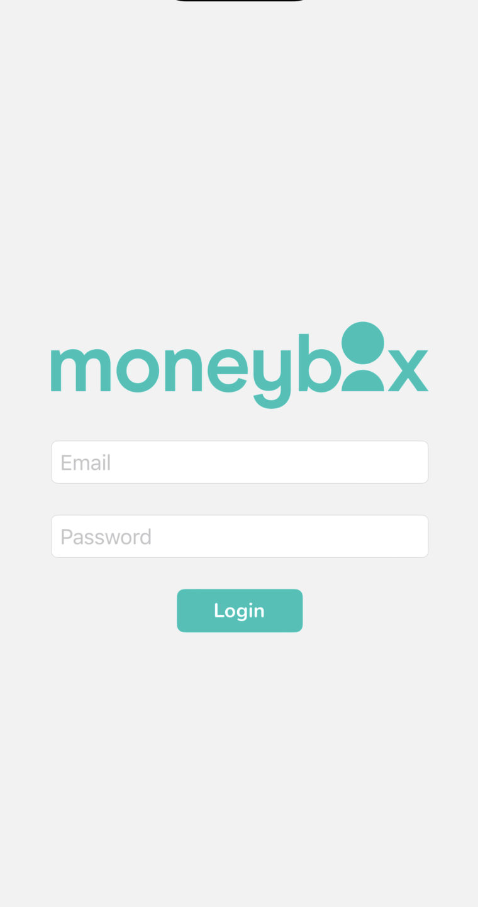
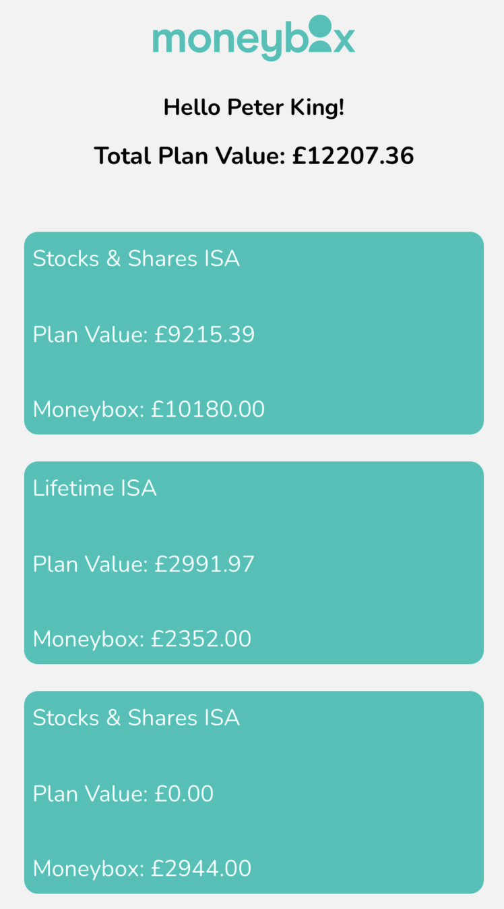
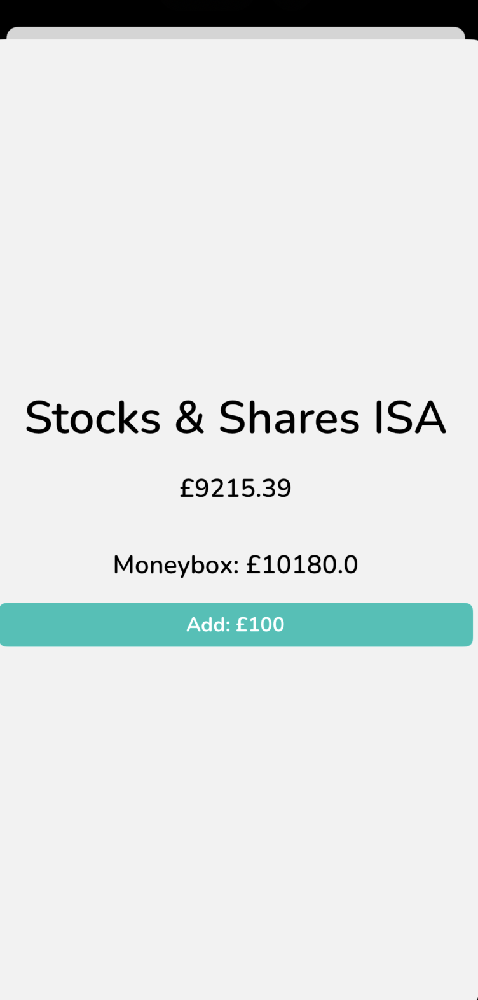

# Moneybox iOS Technical Challenge

## Overview

This application is a technical solution for the MoneyBox iOS challenge. MoneyBox is a savings and investments application which allows users to round up their purchases to the nearest pound and invest the spare change. The goal of this project is to mimic a simplified version of the MoneyBox app, providing a clean and intuitive user interface for users to login, view their savings accounts, and make deposits.

## The Solution

My primary goals with this application was to have the best customer experience. The key things here were for a clear UI:

- No main thread freezing
- Clean (simple) UI
- Fully tested, high code coverage

In the following README, I will detail the general decisions and then each of the 3 views and their associated functions and how I went about making descions.

## Testing

Thorough testing was conducted to ensure the application runs smoothly and as expected. Unit tests were written to verify the correctness of each part of the application and integration tests to check if all parts work together perfectly. To run the tests, select 'Product > Test' in the Xcode menu or use the Cmd + U shortcut.

## General Decisions

### User Interface

I am a sucker for a clean UI in applications, I like to have not a lot going on in the screen, I like the important information to be easily presented without me having to do extra work. I brought this to the application without having too much on screen.

### Multi-threading

Multi-threading was a major focus in the application's design. Having the UI freeze up while we do some logic on the backend makes for a terrible expereince, so I made it so that any user interaction with the backend services has an approrpirate response on the frontend. I will go into more detail in the view sections of this README.

### Accessibility

The accessibility option I included within this app was VoiceOver capability. This meant labelling all my UI elements in the storyboard so that people who are sight-impaired are still able to use the application with little issues.

### Font

My favourite font is comic sans so I went with this for -

**JOKING.**

I like the Nutino font, its a custom font, used quite commonly in iOS applications, that I had to package as part of the application, using the info.plist file, but personally, the flare that comes with a custom font is less like a baby's first application that I've made in Xcode, if that makes sense.

### Colours

I kept with the default Moneybox colour system that came with the clone of the fork, key information highlighted in the same colour as the MoneyBox logo, and the rest not the glaring white that burns your retinas, but the soft grey of the accent colour packaged with the fork.

## Login Screen

I decided on a simple login screen due to the simple nature of the application at hand. In a full login screen, we would expect a number of options to sign in, such as OAuth options, as well as the option to sign up when we dont already have an account.

Validation is handled in 3 different ways:

- Empty email: An alert is sent to the user saying to enter an email if it's empty to proceed.
- Invalid email: A regex is checked against the user entered email to see if it's in a valid email format.
- Empty password: An alert is sent to the user saying to enter a password if it's empty to proceed.

Upon completion of entering a successful login reponse, we then spin up the activity UI element. The key here is that while we are doing all the complex stuff on the backend, we show the user that something's actually happening, with the spinning wheel. 

If there's a success we will move to the next view, if there's an error, we will show them the error they get so they know just what went wrong.

## Home View

The home view is where the fun happens, we let them know their name with a friendly hello at the top, followed by their total plan value with MoneyBox.

Following this is the table view, I've made it a table view, so that we can dynamically pull in what products the user is associated with, and display it in a list.

The UI is a simple selection, spaces between the cells, allowing the user to easily select which product they want to interact with, as well as displaying quick access information in the product.

## Product Detail View

This view is almost like a card that pops up from the bottom of the main view, allowing the user a quick view of what account they are quick depositing into.

The add button shows how much they are putting into the specified product.

Again, we present a spinning activity indicator so that it does not freeze up the applicaiton when we sent a backend request.

We send a refresh function to the original HomeView so that when the user dismisses this ProductDetail view, it is populated with the latest Moneybox figure. We also update the UI on this page too so when the 'Deposit Successful' alert is dismissed, there is instant feedback.

## Future Enhancements

While the current implementation serves its purpose well, there are several enhancements that could be made in the future:

- Implement a 'Sign Up' option: While this solution focuses on logging in, a 'Sign Up' feature would be necessary in a full-scale application.
   
-  Integrate OAuth Sign In Options: Providing options for users to sign in with Google, Apple ID or other OAuth providers could improve the user experience.

- Improved Accessibility: Further improve the app's accessibility to cater to a wider range of users.